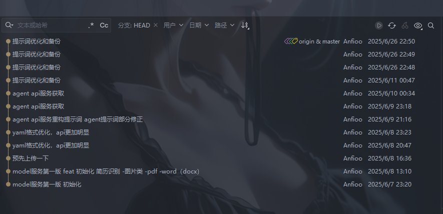
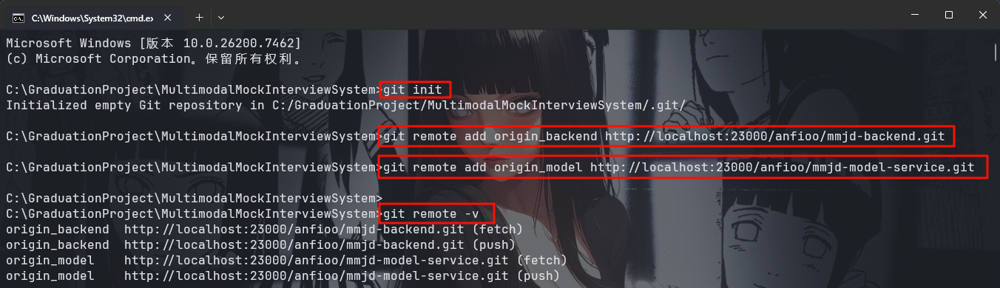
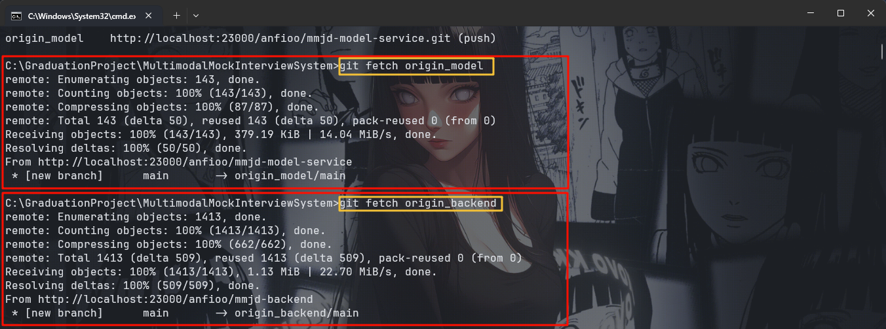

结合你的实际操作场景（Windows 环境、分支为 main 而非 master、两个子项目 backend/model），我帮你补全完整的合并步骤，同时适配 Windows 命令行的特性（避免 Linux 下的 extglob 语法问题）：


我有俩个子项目 `mmjd-model-service` 和 `mmjd-backend`，现在需要将它们合并到一个新的仓库中,并且保留提交记录。


项目1提交记录


项目2提交记录



注意时间

第一步创建要合并的文件主夹 MultimodalMockInterviewSystem

mkdir MultimodalMockInterviewSystem
cd MultimodalMockInterviewSystem
git init
进入目录初始化新的git

2.在 MultimodalMockInterviewSystem 中添加俩个要合并项目的远程分支

git remote add origin_backend http://localhost:23000/anfioo/mmjd-backend.git
git remote add origin_model http://localhost:23000/anfioo/mmjd-model-service.git

验证是否添加成功

git remote -v


如图



4.在 MultimodalMockInterviewSystem 目录下，获取 俩个想要合并的 分支数据

git fetch origin_backend
git fetch origin_model



### 完整操作步骤
#### 第一步：合并 `mmjd-model-service` 并移动到子目录
```bash
# 1. 合并model项目的main分支（允许无关历史）
git merge origin_model/main --allow-unrelated-histories

# 2. 新建model子目录（命名为model_service，可自定义）
mkdir model_service

# 3. 【Windows cmd适配】移动所有文件到model_service（排除.git和model_service本身）
# 方式1：cmd命令（推荐，无需额外配置）
for /d %i in (*) do if not "%i"==".git" if not "%i"=="model_service" move "%i" model_service\
for %i in (*) do if not "%i"==".git" if not "%i"=="model_service" move "%i" model_service\

# 方式2：若用Git Bash（避免!语法报错）
# shopt -s extglob
# mv !(.|..|.git|model_service) model_service/

# 4. 提交合并+移动的记录
git add .
git commit -m "merge mmjd-model-service main branch and move to model_service directory"
```

#### 第二步：合并 `mmjd-backend` 并移动到子目录
```bash
# 1. 合并backend项目的main分支（允许无关历史）
git merge origin_backend/main --allow-unrelated-histories

# 2. 新建backend子目录
mkdir backend

# 3. 【Windows cmd适配】移动剩余文件到backend（排除.git、model_service、backend）
for /d %i in (*) do if not "%i"==".git" if not "%i"=="model_service" if not "%i"=="backend" move "%i" backend\
for %i in (*) do if not "%i"==".git" if not "%i"=="model_service" if not "%i"=="backend" move "%i" backend\

# 4. 提交合并+移动的记录
git add .
git commit -m "merge mmjd-backend main branch and move to backend directory"
```

#### 第三步：关联最终的远程仓库并推送
```bash
# 1. 添加最终的远程仓库地址（替换为你的all仓库地址）
git remote add origin http://localhost:23000/anfioo/MultimodalMockInterviewSystem.git

# 2. 推送main分支到远程（-u 绑定上游分支）
git push -u origin main
```

### 关键注意事项（适配你的场景）
1. **分支名适配**：你的子项目分支是 `main` 而非示例中的 `master`，合并时需用 `origin_model/main`/`origin_backend/main`。
2. **Windows 移动文件适配**：
    - 避免 Linux 下的 `!(.|..|.git)` 语法（Windows cmd 不支持），改用 `for` 循环遍历并排除目标目录。
    - 若使用 Git Bash（推荐），可先执行 `shopt -s extglob` 开启扩展通配，再用 `mv !(.|..|.git|model_service) model_service/`。
3. **合并冲突处理**：
    - 若合并时提示冲突（如两个项目有同名文件 `README.md`），需手动解决冲突后执行 `git add 冲突文件` + `git commit` 完成合并。
4. **远程仓库权限**：确保推送的 `origin` 仓库（`MultimodalMockInterviewSystem.git`）已创建，且你有写入权限。

### 验证结果
合并完成后，你的仓库目录结构应为：
```
MultimodalMockInterviewSystem/
├── backend/          # 原mmjd-backend的所有文件
├── model_service/    # 原mmjd-model-service的所有文件
└── .git/             # 保留所有子项目的提交历史
```

### 查看历史记录（验证提交记录保留）
```bash
# 查看所有提交记录（包含backend和model的历史）
git log --oneline --graph --all

# 单独查看model项目的历史
git log origin_model/main

# 单独查看backend项目的历史
git log origin_backend/main
```

如果操作中遇到冲突或命令报错，可告诉我具体的错误信息，我会帮你针对性解决。