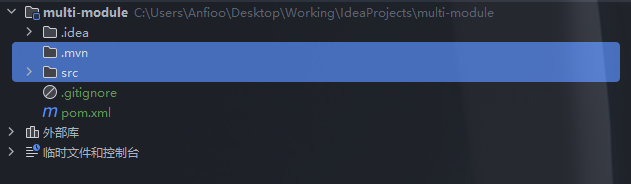
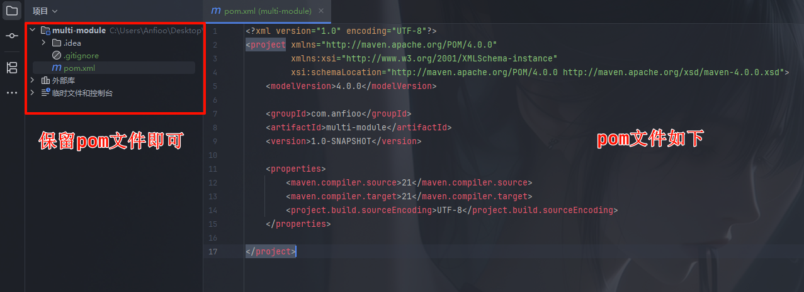
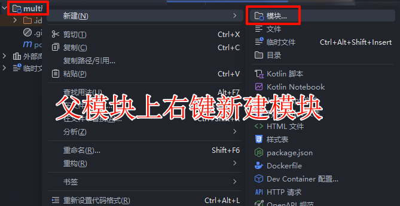
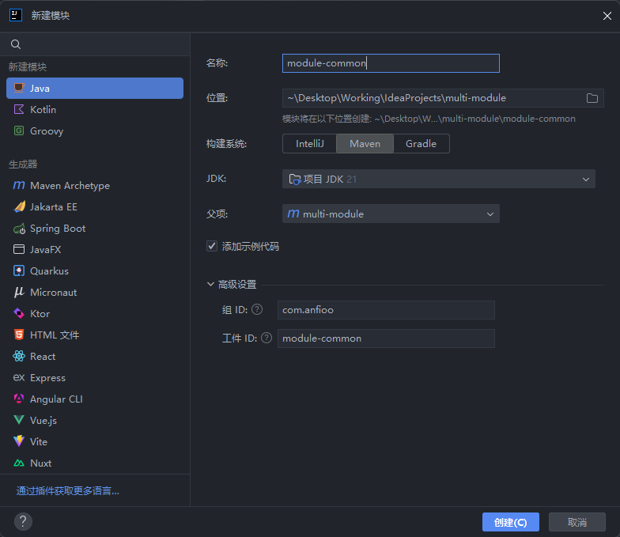
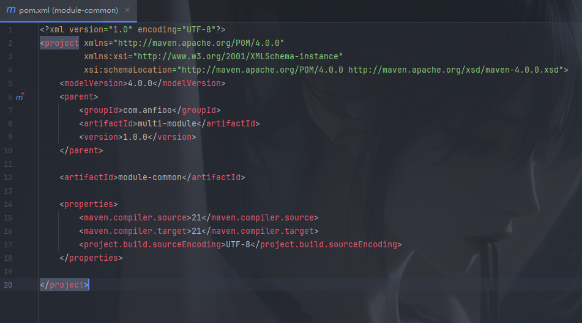
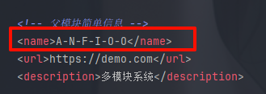
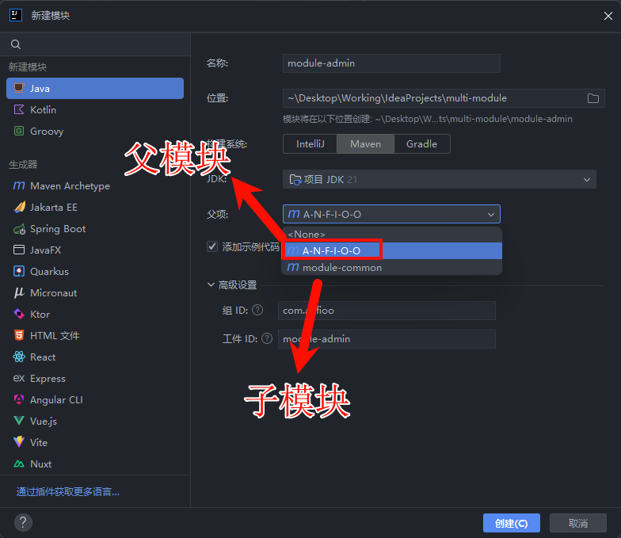
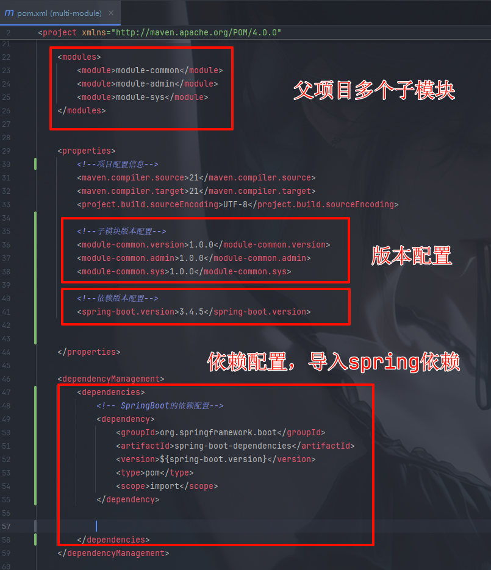
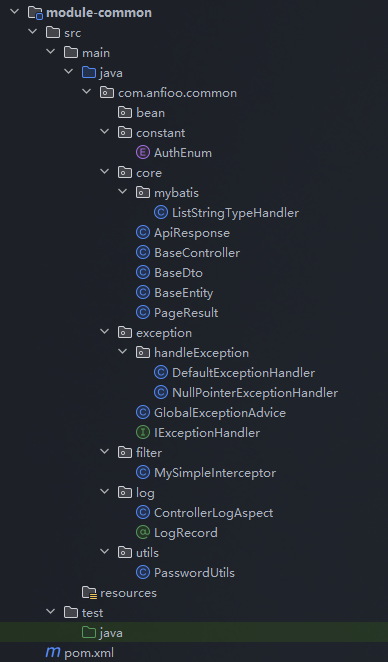

# 多模块 Maven（pom）管理的 Java 后端+前端全栈项目，结构清晰

​
（源码已经上传至 github）

推荐使用github访问，这样最新版的可以拿到
后续我会继续拓展版本安装和切换的实现

Github 地址：https://github.com/Anfioo/WingEnv]

百度网盘 链接: https://pan.baidu.com/s/1w1PRF2LrclPnqvD_c4zLxA?pwd=1234

蓝奏云   链接: https://wwrh.lanzoul.com/ip06H30h1bng

​

# 介绍

Maven 的多模块（Multi-Module）管理方式，根目录下有一个总的 `pom.xml`，每个子模块也有自己的 `pom.xml`。

## 根 pom.xml 的作用

- **统一依赖管理**：在根 pom 中声明所有模块通用的依赖版本，避免版本冲突。
- **模块聚合**：通过 `<modules>` 标签聚合所有子模块，方便一次性编译、打包、测试。
- **父子继承**：子模块的 pom 通过 `<parent>` 标签继承根 pom，简化配置。

## 子模块 pom.xml 的作用

- **继承父 pom**：通过 `<parent>` 继承根 pom，自动获得依赖和插件配置。

- **声明自身依赖**：只需声明本模块特有的依赖。

- **模块间依赖**：如 `mmjd-admin` 依赖 `mmjd-common`，可通过 `<dependency>` 引用。


# 开始

## 创建父模块

1.以 idea 为例，创建如下


2.删掉无需的文件（因为项目的 pom 文件只是作为依赖管理使用）





3.最终如下



添加一些标签


代码如下

```xml
<?xml version="1.0" encoding="UTF-8"?>
<project xmlns="http://maven.apache.org/POM/4.0.0"
         xmlns:xsi="http://www.w3.org/2001/XMLSchema-instance"
         xsi:schemaLocation="http://maven.apache.org/POM/4.0.0 http://maven.apache.org/xsd/maven-4.0.0.xsd">
    <modelVersion>4.0.0</modelVersion>

    <groupId>com.anfioo</groupId>
    <artifactId>multi-module</artifactId>

    <version>1.0.0</version>


    <packaging>pom</packaging>


    <!-- 父模块简单信息 -->
    <name>A-N-F-I-O-O</name>
    <url>https://demo.com</url>
    <description>多模块系统</description>


    <properties>
        <maven.compiler.source>21</maven.compiler.source>
        <maven.compiler.target>21</maven.compiler.target>
        <project.build.sourceEncoding>UTF-8</project.build.sourceEncoding>
    </properties>

    <dependencyManagement>
   			<!-- 统一依赖版本 -->
    </dependencyManagement>


</project>
```

### 解释

**1.packaging: 默认情况下，Maven 项目会打包成 `.jar` 或 `.war` 文件，但：**

`packaging = pom` 的作用是：

> 告诉 Maven：这是一个 **聚合/父项目（Parent/Aggregator）**，**本身不打包可执行代码**，而是 **用于管理子模块** 和 **统一依赖配置**。


**2.dependencyManagement: 在多模块项目中，如果不加以统一，子模块可能引用了不一致版本的依赖包，导致版本冲突或行为异常。**

`dependencyManagement` 的作用是：

> 在父 `pom` 中 **统一指定依赖版本号**，子模块使用时只需写 `groupId` + `artifactId`，**不需要再写版本**。

示例：

父模块定义：

```xml
<dependencyManagement>
    <dependencies>
        <dependency>
            <groupId>org.springframework.boot</groupId>
            <artifactId>spring-boot-starter-web</artifactId>
            <version>3.2.0</version>
        </dependency>
    </dependencies>
</dependencyManagement>
```

子模块使用时：

```xml
<dependency>
    <groupId>org.springframework.boot</groupId>
    <artifactId>spring-boot-starter-web</artifactId>
    <!-- 不写版本 -->
</dependency>
```

这样可以 **集中控制版本号**，保证整个多模块项目中使用相同版本的依赖。

## 创建子模块

父模块上右键新建模块




### 创建模块 module-common 示例



> module-common 为公共模块，存放通用的工具类、常量、基础实体、异常处理等，供其他模块依赖。




一个基本的子模块就是这样了

我们来 **重点介绍 Maven 中 `<parent>` 元素的作用与特性**。

------

#### 解释


`<parent>` 是什么？

在 Maven 的子模块中，`<parent>` 用于 **声明继承哪个父模块的配置**。

```xml
<parent>
    <groupId>com.anfioo</groupId>
    <artifactId>multi-module</artifactId>
    <version>1.0.0</version>
</parent>
```

这段代码告诉 Maven：

> 当前模块是 `com.anfioo:multi-module:1.0.0` 的子模块，它会**继承父模块中的所有公共配置、属性、插件和依赖管理信息**。

`<parent>` 的主要特性

| 特性             | 说明                                                         |
| ---------------- | ------------------------------------------------------------ |
| 继承属性         | 子模块会继承父模块的 `<properties>`，如 Java 编译版本、编码等。 |
| 继承依赖管理     | 父模块通过 `<dependencyManagement>` 指定的依赖版本，子模块可以引用而无需写版本号。 |
| 继承插件配置     | Maven 插件的版本、执行绑定（如 `maven-compiler-plugin`）在父模块配置后，子模块无需重复配置。 |
| 继承构建配置     | 包括 `<build>` 下的目录结构、自定义资源文件路径等。          |
| 支持相对路径查找 | 默认 `parent` 所引用的 POM 文件，会去上层目录找 `pom.xml`，可通过 `<relativePath>` 定义路径。 |

注意点

| 注意点                                 | 说明                                                         |
| -------------------------------------- | ------------------------------------------------------------ |
| 一个模块只能有一个 `<parent>`          | Maven 不支持多重继承，只能继承一个父模块。                   |
| `<parent>` 与 `<modules>` 没有强制关系 | 你可以继承一个父模块，但不一定在其 `<modules>` 中列出（但通常会一起使用）。 |
| 父模块可以是本地项目，也可以是远程依赖 | 比如继承 `spring-boot-starter-parent`，就是远程继承。        |

此时 idea 会自动配置父模块下的子模块 module-common


子模块代码如下

```xml
<?xml version="1.0" encoding="UTF-8"?>
<project xmlns="http://maven.apache.org/POM/4.0.0"
         xmlns:xsi="http://www.w3.org/2001/XMLSchema-instance"
         xsi:schemaLocation="http://maven.apache.org/POM/4.0.0 http://maven.apache.org/xsd/maven-4.0.0.xsd">
    <modelVersion>4.0.0</modelVersion>
    <parent>
        <groupId>com.anfioo</groupId>
        <artifactId>multi-module</artifactId>
        <version>1.0.0</version>
    </parent>

    <artifactId>module-common</artifactId>

    <description>
        module-common 为公共模块，存放通用的工具类、常量、基础实体、异常处理等，供其他模块依赖。
    </description>

    <dependencies>

    </dependencies>

</project>
```


# 基于 spring boot 项目的多模块项目设计

继续生成 module-admin 如下




A-N-F-I-O-O 是由于我配置了名称 就是上面的 multi-module




父项目 pom 设计



!

## 知识点：properties

`properties` 是指 Maven 项目中 `<properties>` 标签，它是 Maven `pom.xml` 中非常重要的一部分，用于 **定义全局属性（变量）**，可以在整个 POM 文件中重复引用、统一管理。

统一管理版本（不用写版本号）

引入这个依赖后，Spring Boot 的大量依赖（比如 `spring-boot-starter-web`, `spring-boot-starter-data-jpa` 等）就 **不需要手动指定版本号** 了。

例如：

```xml
<dependency>
    <groupId>org.springframework.boot</groupId>
    <artifactId>spring-boot-starter-web</artifactId>
</dependency>
```

不用写 `<version>`，Maven 会自动使用 `spring-boot-dependencies` 中指定的版本。

## 知识点：spring-boot-dependencies 依赖

避免版本冲突，官方推荐方式

Spring Boot 官方推荐在你自定义的 `parent pom` 中，**通过 `dependencyManagement + import` 方式** 引入版本 BOM（Bill of Materials），而不是直接当 parent


考虑到是普通的 spring boot 多模块版本，所以额外加入了一些常用的依赖

主要有 mybatis，mybatis-plus，mysql，alibaba 数据库连接池，swagger 等等

也使用了构建插件 （保持编译版本为 java21） 和带参构造

## 父模块 multi-module pom 文件

所以父模块如下

```xml
<?xml version="1.0" encoding="UTF-8"?>
<project xmlns="http://maven.apache.org/POM/4.0.0"
         xmlns:xsi="http://www.w3.org/2001/XMLSchema-instance"
         xsi:schemaLocation="http://maven.apache.org/POM/4.0.0 http://maven.apache.org/xsd/maven-4.0.0.xsd">
    <modelVersion>4.0.0</modelVersion>

    <groupId>com.anfioo</groupId>
    <artifactId>multi-module</artifactId>

    <version>1.0.0</version>


    <packaging>pom</packaging>


    <!-- 父模块简单信息 -->
    <name>A-N-F-I-O-O</name>
    <url>https://demo.com</url>
    <description>多模块系统</description>


    <modules>
        <module>module-common</module>
        <module>module-admin</module>
        <module>module-sys</module>
    </modules>


    <properties>
        <!--        项目配置信息-->
        <maven.compiler.source>21</maven.compiler.source>
        <maven.compiler.target>21</maven.compiler.target>
        <project.build.sourceEncoding>UTF-8</project.build.sourceEncoding>

        <!--        子模块版本配置-->
        <module-common.version>1.0.0</module-common.version>
        <module-common.admin>1.0.0</module-common.admin>
        <module-common.sys>1.0.0</module-common.sys>

        <!--        依赖版本配置-->
        <spring-boot.version>3.4.5</spring-boot.version>

        <!--        mybatis依赖版本配置-->
        <mybatis-spring-boot.version>3.5.10.1</mybatis-spring-boot.version>
        <mybatis-spring-boot-test.version>3.0.4</mybatis-spring-boot-test.version>
        <mybatis-plus-extension.version>3.5.7</mybatis-plus-extension.version>


        <!--        数据库依赖版本配置-->
        <druid-spring-boot-starter.version>1.2.23</druid-spring-boot-starter.version>

        <!--        swagger依赖版本配置-->
        <springdoc.version>2.8.8</springdoc.version>


    </properties>

    <dependencyManagement>
        <dependencies>
            <!--         SpringBoot的依赖配置-->
            <dependency>
                <groupId>org.springframework.boot</groupId>
                <artifactId>spring-boot-dependencies</artifactId>
                <version>${spring-boot.version}</version>
                <type>pom</type>
                <scope>import</scope>
            </dependency>

            <!--            本地多模块版本配置-->
            <dependency>
                <groupId>com.anfioo</groupId>
                <artifactId>module-common</artifactId>
                <version>${module-common.version}</version>
            </dependency>
            <dependency>
                <groupId>com.anfioo</groupId>
                <artifactId>module-admin</artifactId>
                <version>${module-common.admin}</version>
            </dependency>

            <dependency>
                <groupId>com.anfioo</groupId>
                <artifactId>module-sys</artifactId>
                <version>${module-common.sys}</version>
            </dependency>


            <!--        mybatis plus版本配置-->
            <dependency>
                <groupId>com.baomidou</groupId>
                <artifactId>mybatis-plus-spring-boot3-starter</artifactId>
                <version>${mybatis-spring-boot.version}</version>
            </dependency>

            <dependency>
                <groupId>org.mybatis.spring.boot</groupId>
                <artifactId>mybatis-spring-boot-starter-test</artifactId>
                <version>${mybatis-spring-boot-test.version}</version>
                <scope>test</scope>
            </dependency>

            <!--        mybatis plus 分页插件 版本配置-->
            <dependency>
                <groupId>com.baomidou</groupId>
                <artifactId>mybatis-plus-extension</artifactId>
                <version>${mybatis-plus-extension.version}</version>
            </dependency>

            <!--            数据库连接池版本配置-->
            <dependency>
                <groupId>com.alibaba</groupId>
                <artifactId>druid-spring-boot-starter</artifactId>
                <version>${druid-spring-boot-starter.version}</version>
            </dependency>


            <!--            swagger版本配置-->
            <dependency>
                <groupId>org.springdoc</groupId>
                <artifactId>springdoc-openapi-starter-webmvc-ui</artifactId>
                <version>${springdoc.version}</version>
            </dependency>


        </dependencies>
    </dependencyManagement>

    <!-- 构建插件 （保持编译版本为java21） 和带参构造 -->
    <build>
        <plugins>
            <plugin>
                <groupId>org.apache.maven.plugins</groupId>
                <artifactId>maven-compiler-plugin</artifactId>
                <version>3.8.1</version>
                <configuration>
                    <source>${java.version}</source>
                    <target>${java.version}</target>
                    <release>${java.version}</release>
                    <encoding>${project.build.sourceEncoding}</encoding>
                    <parameters>true</parameters>
                </configuration>
            </plugin>
        </plugins>
    </build>


</project>
```


## 子模块 module-common pom 文件


```xml
<?xml version="1.0" encoding="UTF-8"?>
<project xmlns="http://maven.apache.org/POM/4.0.0"
         xmlns:xsi="http://www.w3.org/2001/XMLSchema-instance"
         xsi:schemaLocation="http://maven.apache.org/POM/4.0.0 http://maven.apache.org/xsd/maven-4.0.0.xsd">
    <modelVersion>4.0.0</modelVersion>
    <parent>
        <groupId>com.anfioo</groupId>
        <artifactId>multi-module</artifactId>
        <version>1.0.0</version>
    </parent>

    <artifactId>module-common</artifactId>

    <description>
        module-common 为公共模块，存放通用的工具类、常量、基础实体、异常处理等，供其他模块依赖。
    </description>

    <dependencies>
        <!--        spring web-->
        <dependency>
            <groupId>org.springframework.boot</groupId>
            <artifactId>spring-boot-starter-web</artifactId>
        </dependency>

        <!--        spring boot测试类-->
        <dependency>
            <groupId>org.springframework.boot</groupId>
            <artifactId>spring-boot-starter-test</artifactId>
            <scope>test</scope>
        </dependency>

        <!--        lombok-->
        <dependency>
            <groupId>org.projectlombok</groupId>
            <artifactId>lombok</artifactId>
            <scope>annotationProcessor</scope>
        </dependency>


        <!--        Spring AOP -->
        <dependency>
            <groupId>org.springframework.boot</groupId>
            <artifactId>spring-boot-starter-aop</artifactId>
        </dependency>


        <!--        mybatis 测试-->

        <dependency>
            <groupId>org.mybatis.spring.boot</groupId>
            <artifactId>mybatis-spring-boot-starter-test</artifactId>
            <scope>test</scope>
        </dependency>

        <!--        mybatis 分页插件-->
        <dependency>
            <groupId>com.baomidou</groupId>
            <artifactId>mybatis-plus-extension</artifactId>
        </dependency>

        <!--        mybatis-->
        <dependency>
            <groupId>com.baomidou</groupId>
            <artifactId>mybatis-plus-spring-boot3-starter</artifactId>
        </dependency>

        <!--        密码加密-->
        <dependency>
            <groupId>org.springframework.security</groupId>
            <artifactId>spring-security-crypto</artifactId>
        </dependency>

        <!--        Apache 提供的一个常用工具库-->

        <dependency>
            <groupId>org.apache.commons</groupId>
            <artifactId>commons-lang3</artifactId>
        </dependency>


    </dependencies>

</project>
```

### 模块作用

- **定位**：公共模块，存放所有子模块都需要用到的通用代码。
- **主要内容**：
    - `bean/`：通用实体类。
    - `constant/`：常量类（如 `AuthEnum.java`）。
    - `core/`：核心基础类（如 `ApiResponse`, `BaseController`, `BaseEntity` 等）。
    - `exception/`：全局异常处理（如 `GlobalExceptionAdvice`，自定义异常处理器）。
    - `filter/`：过滤器或拦截器（如 `MySimpleInterceptor`）。
    - `log/`：日志相关（如 AOP 日志切面）。
    - `utils/`：工具类（如 `PasswordUtils`）。
- **作用**：为其他模块提供基础能力，避免重复造轮子。


## 子模块 module-admin pom 文件

```xml
<?xml version="1.0" encoding="UTF-8"?>
<project xmlns="http://maven.apache.org/POM/4.0.0"
         xmlns:xsi="http://www.w3.org/2001/XMLSchema-instance"
         xsi:schemaLocation="http://maven.apache.org/POM/4.0.0 http://maven.apache.org/xsd/maven-4.0.0.xsd">
    <modelVersion>4.0.0</modelVersion>
    <parent>
        <groupId>com.anfioo</groupId>
        <artifactId>multi-module</artifactId>
        <version>1.0.0</version>
    </parent>

    <artifactId>module-admin</artifactId>
    <description>
        主启动入口模块 管理员模块
        后台管理系统，通常包含管理端的Controller、Service、配置等。

    </description>

    <dependencies>

        <dependency>
            <groupId>com.anfioo</groupId>
            <artifactId>module-sys</artifactId>
        </dependency>


        <dependency>
            <groupId>com.anfioo</groupId>
            <artifactId>module-common</artifactId>
        </dependency>

        <!--        spring boot测试类-->
        <dependency>
            <groupId>org.springframework.boot</groupId>
            <artifactId>spring-boot-starter-test</artifactId>
            <scope>test</scope>
        </dependency>


        <!--mysql-->
        <dependency>
            <groupId>com.mysql</groupId>
            <artifactId>mysql-connector-j</artifactId>
            <scope>runtime</scope>
        </dependency>

        <!--        数据库连接池-->
        <dependency>
            <groupId>com.alibaba</groupId>
            <artifactId>druid-spring-boot-starter</artifactId>
        </dependency>

        <!--        swagger 配置-->
        <dependency>
            <groupId>org.springdoc</groupId>
            <artifactId>springdoc-openapi-starter-webmvc-ui</artifactId>
        </dependency>


    </dependencies>


</project>
```

### 模块作用

- **定位**：管理后台模块，通常用于后台管理系统的业务实现。
- **主要内容**：
    - `config/`：配置类（如 Swagger、MyBatis、Web 配置等）。
    - `StartApplication.java`：启动类，表明该模块可独立运行。
    - `resources/`：配置文件（如 `application.yaml`、MyBatis 配置等）。
    - `test/`：单元测试类。
- **作用**：实现后台管理相关的业务逻辑和接口。


## 子模块 module-sys pom 文件

```xml
<?xml version="1.0" encoding="UTF-8"?>
<project xmlns="http://maven.apache.org/POM/4.0.0"
         xmlns:xsi="http://www.w3.org/2001/XMLSchema-instance"
         xsi:schemaLocation="http://maven.apache.org/POM/4.0.0 http://maven.apache.org/xsd/maven-4.0.0.xsd">
    <modelVersion>4.0.0</modelVersion>
    <parent>
        <groupId>com.anfioo</groupId>
        <artifactId>multi-module</artifactId>
        <version>1.0.0</version>
    </parent>

    <artifactId>module-sys</artifactId>

    <properties>
        <maven.compiler.source>21</maven.compiler.source>
        <maven.compiler.target>21</maven.compiler.target>
        <project.build.sourceEncoding>UTF-8</project.build.sourceEncoding>
    </properties>


    <dependencies>
        <dependency>
            <groupId>com.anfioo</groupId>
            <artifactId>module-common</artifactId>
        </dependency>
    </dependencies>

</project>
```

### 模块作用

- **定位**：系统业务模块，通常用于系统核心业务（如用户、权限等）。
- **主要内容**：
    - `controller/`：控制器（如 `SysUserController`）。
    - `dto/`：数据传输对象。
    - `entity/`：实体类（如 `SysUser`）。
    - `mapper/`：MyBatis Mapper 接口及 XML（如 `SysUserMapper`、`SysUserMapper.xml`）。
    - `service/`：业务服务接口及实现（如 `SysUserService`、`SysUserServiceImpl`）。
    - `resources/mapper/`：MyBatis 映射文件。
- **作用**：实现系统核心业务功能，通常会被 admin 或其他模块调用。


## 总预览结构图


## 项目结构优点

1. **高内聚低耦合**：公共代码抽离到 `module-common`，各业务模块职责单一。
2. **易于维护和扩展**：新增业务模块只需新建子模块即可，互不影响。
3. **统一依赖管理**：父级 `pom.xml` 统一依赖版本，避免冲突。
4. **适合团队协作**：不同团队成员可负责不同模块，互不干扰。


> 接下来介绍每个模块可以实现的功能


# 每个模块实现功能详解


##  common 主要包和类说明



### 介绍

**1）bean/**

- **作用**：存放通用的实体类或 VO/DTO，便于模块间数据传递和复用。

**2）constant/**

- **AuthEnum.java**：定义项目中的权限、角色等常量枚举，方便统一管理和调用。

**3）core/**

- **ApiResponse.java**：统一的 API 响应封装类，规范接口返回结构（如 code、msg、data）。
- **BaseController.java**：所有 Controller 的基类，封装通用方法（如统一异常处理、响应封装等）。
- **BaseDto.java**：DTO 基类，便于扩展和统一处理。
- **BaseEntity.java**：实体基类，通常包含 id、创建时间、更新时间等通用字段。
- **PageResult.java**：分页结果封装类，便于前后端分页数据交互。
- **mybatis/ListStringTypeHandler.java**：MyBatis 类型处理器，支持 List <String> 与数据库字段的自动转换。

**4）exception/**

- **GlobalExceptionAdvice.java**：全局异常处理器，捕获并统一处理项目中的异常，提升系统健壮性。
- **handleException/**：自定义异常处理器（如默认异常、空指针异常等），实现更细粒度的异常管理。
- **IExceptionHandler.java**：异常处理器接口，便于扩展和自定义异常处理逻辑。

**5）filter/**

- **MySimpleInterceptor.java**：自定义拦截器，可用于请求日志、权限校验等场景。

**6）log/**

- **ControllerLogAspect.java**：AOP 切面，自动记录 Controller 层的操作日志。
- **LogRecord.java**：日志记录相关实体或注解，配合切面实现自动化日志。

**7）utils/**

- **PasswordUtils.java**：密码加密、校验等工具类，提升安全性和代码复用。

> 这个是一个简单的设计，主要是想要明确这个模块的职责

### 职责

- **高复用**：所有通用代码集中管理，避免重复开发。
- **解耦**：业务模块只需依赖 common，无需关心具体实现细节。
- **易扩展**：新增通用功能只需在 common 扩展即可，所有依赖模块自动受益。
- **统一规范**：如统一响应、统一异常、统一日志，提升项目整体规范性和可维护性。

---

### 5. 典型用法举例

- 业务模块只需在 `pom.xml` 中依赖 `module-common`，即可直接使用其中的工具类、基础类、异常处理等。
- 例如，`module-admin` 和 `module-sys` 的 Controller 都可以继承 `BaseController`，返回数据时用 `ApiResponse`，异常自动被 `GlobalExceptionAdvice` 捕获处理。

---

### 6. 总结

`module-common` 是多模块项目的“地基”，为上层业务提供了坚实的支撑。合理设计和维护 common 模块，是保证大型项目高效开发和稳定运行的关键。

### 详细介绍

#### 枚举常量

```java
package com.anfioo.common.constant;

public enum AuthEnum {
    SUCCESS(0, "注册成功"),
    USERNAME_EXISTS(1, "用户名已存在"),
    PASSWORD_TOO_WEAK(2, "密码强度不足，需包含字母、数字和特殊字符，长度8-20位"),
    USERNAME_INVALID(3, "用户名格式无效，只能包含字母、数字和下划线，长度4-20位"),
    REGISTER_FAILED(4, "注册失败，请稍后重试");

    private final int code;
    private final String message;

    AuthEnum(int code, String message) {
        this.code = code;
        this.message = message;
    }

    public int getCode() {
        return code;
    }

    public String getMessage() {
        return message;
    }
}
```

#### 全局统一响应体设计

```java
package com.anfioo.common.core;

import lombok.Data;

import java.io.Serial;
import java.io.Serializable;

/**
 * 全局统一响应体
 *
 * @param <T> 返回数据类型
 */

@Data
public class ApiResponse<T> implements Serializable {

    @Serial
    private static final long serialVersionUID = 1L;

    /**
     * 业务状态码，0 表示成功，非 0 表示失败
     */
    private int code;

    /**
     * 提示信息
     */
    private String message;

    /**
     * 返回的数据主体
     */
    private T data;

    public ApiResponse() {
    }

    public ApiResponse(int code, String message, T data) {
        this.code = code;
        this.message = message;
        this.data = data;
    }

    // ==================== 静态工厂方法 ====================

    /**
     * 成功，且无返回数据
     */
    public static <T> ApiResponse<T> ok() {
        return new ApiResponse<>(0, "success", null);
    }

    /**
     * 成功，带返回数据
     */
    public static <T> ApiResponse<T> ok(T data) {
        return new ApiResponse<>(0, "success", data);
    }

    /**
     * 成功，自定义提示 & 返回数据
     */
    public static <T> ApiResponse<T> ok(String message, T data) {
        return new ApiResponse<>(0, message, data);
    }

    /**
     * 失败，自定义错误码 & 错误信息
     */
    public static <T> ApiResponse<T> error(int code, String message) {
        return new ApiResponse<>(code, message, null);
    }

    /**
     * 失败，使用默认错误码 -1
     */
    public static <T> ApiResponse<T> error(String message) {
        return new ApiResponse<>(-1, message, null);
    }


    /**
     * 失败，自定义错误信息和数据
     */
    public static <T> ApiResponse<T> error(String message, T data) {
        return new ApiResponse<>(-1, message, data);
    }

    @Override
    public String toString() {
        return "ApiResponse{" +
                "code=" + code +
                ", message='" + message + '\'' +
                ", data=" + data +
                '}';
    }
}
```

#### controller 层基类

```java
package com.anfioo.common.core;

import org.slf4j.Logger;
import org.slf4j.LoggerFactory;

public class BaseController {

    protected final Logger logger = LoggerFactory.getLogger(this.getClass());

    /**
     * 返回成功（无数据）
     */
    public <T> ApiResponse<T> success() {
        return ApiResponse.ok();
    }

    /**
     * 返回成功（带数据）
     */
    public <T> ApiResponse<T> success(T data) {
        return ApiResponse.ok(data);
    }

    /**
     * 返回成功（自定义消息 + 数据）
     */
    public <T> ApiResponse<T> success(String message, T data) {
        return ApiResponse.ok(message, data);
    }

    /**
     * 返回失败（默认 -1）
     */
    public <T> ApiResponse<T> error(String message) {
        return ApiResponse.error(message);
    }

    /**
     * 返回失败（指定 code）
     */
    public <T> ApiResponse<T> error(int code, String message) {
        return ApiResponse.error(code, message);
    }


    /**
     * 快捷返回布尔状态结果
     */
    public <T> ApiResponse<T> toResult(boolean success) {
        return success ? success() : error("操作失败");
    }


    /**
     * 快捷返回布尔状态结果
     */
    public <T> ApiResponse<T> toResult(boolean success, T message) {
        return success ? success(message) : error("操作失败");
    }


}
```


#### dto 层基类

```java
package com.anfioo.common.core;

import java.io.Serial;
import java.io.Serializable;

/**
 * 通用 DTO 基类，只提供序列化能力
 *
 * 本类主要用于继承，以实现数据传输对象（DTO）的序列化功能
 * 实现了 Serializable 接口，以确保对象可以被序列化和反序列化
 */
public class BaseDto implements Serializable {

    /**
     * 序列化版本标识符
     *
     * 用于在序列化和反序列化过程中确保类的版本一致
     * 如果类的结构发生变化（如添加字段），可以更改此值以确保向后兼容性
     */
    @Serial
    private static final long serialVersionUID = 1L;
}
```

#### 实体层的基类

```java
package com.anfioo.common.core;

import lombok.Data;

import java.time.LocalDateTime;

/**
 * 基础实体类，提供所有实体类共有的基本属性
 */
@Data
public class BaseEntity {

    /**
     * 创建时间，用于记录实体创建的时刻
     */
    private LocalDateTime createTime;

    /**
     * 更新时间，用于记录实体最后一次更新的时刻
     */
    private LocalDateTime updateTime;

}
```

> 还可以放入其他可能公用的类就不一一举例了

#### 全局异常处理类

```java
package com.anfioo.common.exception;

import com.anfioo.common.core.ApiResponse;
import org.springframework.http.ResponseEntity;
import org.springframework.web.bind.annotation.ControllerAdvice;
import org.springframework.web.bind.annotation.ExceptionHandler;
import org.springframework.web.context.request.WebRequest;

import java.util.List;

/**
 * 全局异常处理类
 * 用于统一处理所有未被捕获的异常
 */
@ControllerAdvice
public class GlobalExceptionAdvice {

    // 所有异常处理器的列表
    private final List<IExceptionHandler> handlerList;

    /**
     * 构造函数，初始化异常处理器列表
     *
     * @param handlerList 异常处理器列表
     */
    public GlobalExceptionAdvice(List<IExceptionHandler> handlerList) {
        this.handlerList = handlerList;
    }

    /**
     * 处理所有异常的处理器
     * 遍历所有异常处理器，找到支持处理当前异常的处理器进行处理
     * 如果没有找到合适的处理器，则返回一个通用的错误响应
     *
     * @param ex      异常对象
     * @param request Web请求对象
     * @return 响应实体，包含处理结果
     */
    @ExceptionHandler(Throwable.class)
    public ResponseEntity<ApiResponse<Object>> handleAll(Throwable ex, WebRequest request) {
        for (IExceptionHandler handler : handlerList) {
            if (handler.supports(ex)) {
                ApiResponse<Object> body = handler.handle(ex, request);
                return ResponseEntity.ok(body);
            }
        }

        // 理论不会走到这里
        return ResponseEntity.ok(ApiResponse.error("未知异常"));
    }
}
```

```java
package com.anfioo.common.exception;

import com.anfioo.common.core.ApiResponse;
import org.springframework.http.ResponseEntity;
import org.springframework.web.context.request.WebRequest;

/**
 * 异常处理策略接口，支持扩展
 */
public interface IExceptionHandler {
    /**
     * 判断是否支持当前异常类型
     */
    boolean supports(Throwable ex);

    /**
     * 处理异常并返回响应结果
     */
    ApiResponse<Object> handle(Throwable ex, WebRequest request);
}
```

示例

```java
package com.anfioo.common.exception.handleException;

import com.anfioo.common.core.ApiResponse;
import com.anfioo.common.exception.IExceptionHandler;
import org.springframework.core.annotation.Order;
import org.springframework.stereotype.Component;
import org.springframework.web.context.request.WebRequest;

/**
 * 默认异常处理器，用于处理系统中未被其他异常处理器捕获的异常
 * 该处理器被赋予最低的优先级（最高的Order值），确保自定义异常处理器先于它执行
 */
@Component
@Order(Integer.MAX_VALUE)
public class DefaultExceptionHandler implements IExceptionHandler {

    /**
     * 支持所有类型的异常
     *
     * @param ex 异常对象
     * @return 总是返回true，表示支持所有异常
     */
    @Override
    public boolean supports(Throwable ex) {
        return true;
    }

    /**
     * 处理异常，返回一个通用的错误响应
     *
     * @param ex 异常对象
     * @param request Web请求对象
     * @return 返回一个包含错误信息的ApiResponse对象
     */
    @Override
    public ApiResponse<Object> handle(Throwable ex, WebRequest request) {
        ex.printStackTrace(); // 或使用日志记录系统
        return ApiResponse.error("系统异常，请稍后再试");
    }
}
```


#### 自定义拦截器

这里只是简单调用，全部放行

```java
package com.anfioo.common.filter;

import jakarta.servlet.http.HttpServletRequest;
import jakarta.servlet.http.HttpServletResponse;
import org.springframework.stereotype.Component;
import org.springframework.web.servlet.HandlerInterceptor;

import java.io.PrintWriter;

/**
 * 自定义拦截器，用于在请求处理前进行预处理
 */
@Component
public class MySimpleInterceptor implements HandlerInterceptor {

    /**
     * 在请求处理之前进行调用
     *
     * @param request  HttpServletRequest对象，用于获取请求信息
     * @param response HttpServletResponse对象，用于设置响应信息
     * @param handler  请求处理器，可以是HandlerMethod或RequestMappingHandler
     * @return boolean 返回值为true时继续执行下一个拦截器，若无其他拦截器则执行目标方法；返回false时中断执行链
     * @throws Exception 可能抛出的异常
     */
    @Override
    public boolean preHandle(HttpServletRequest request, HttpServletResponse response, Object handler) throws Exception {
        // 获取请求头中的Authorization字段
        String token = request.getHeader("Authorization");

        // 检查token是否存在且非空
        if (token == null || token.isBlank()) {
            // 如果token不存在或为空，则在响应头中添加消息说明
            response.addHeader("Message", "NO Token");

            // 全都放行
            return true;
//            return false;
        }

        // 如果token存在且非空，则继续执行下一个拦截器或目标方法
        return true;
    }
}
```


#### 日志切片

```java
package com.anfioo.common.log;

import jakarta.servlet.http.HttpServletRequest;
import lombok.extern.slf4j.Slf4j;
import org.aspectj.lang.ProceedingJoinPoint;
import org.aspectj.lang.annotation.*;
import org.slf4j.Logger;
import org.slf4j.LoggerFactory;
import org.springframework.stereotype.Component;
import org.springframework.web.context.request.RequestContextHolder;
import org.springframework.web.context.request.ServletRequestAttributes;

import java.util.Arrays;


/**
 * 全局 Controller 层日志记录切面
 */
@Aspect
@Component
@Slf4j
public class ControllerLogAspect {

    // 切入所有 controller 包及子包下的公共方法
    @Pointcut("execution(public * com.anfioo..controller..*(..))")
    public void controllerMethods() {
    }

    @Around("controllerMethods()")
    public Object logAround(ProceedingJoinPoint joinPoint) throws Throwable {
        long start = System.currentTimeMillis();

        // 获取当前执行的目标类
        Class<?> targetClass = joinPoint.getTarget().getClass();
        Logger logger = LoggerFactory.getLogger(targetClass);

        ServletRequestAttributes attributes =
                (ServletRequestAttributes) RequestContextHolder.getRequestAttributes();
        HttpServletRequest request = attributes.getRequest();

        String url = request.getRequestURL().toString();
        String method = request.getMethod();
        String ip = request.getRemoteAddr();
        String classMethod = joinPoint.getSignature().toShortString();
        Object[] args = joinPoint.getArgs();

        logger.info("{}-{}  | Handler: {} ", method, url, classMethod);
        System.out.println("Args: " + Arrays.toString(args));

        Object result;
        try {
            result = joinPoint.proceed();
        } catch (Exception e) {
            logger.error("❌ 异常发生 - {} {}", classMethod, e.getMessage(), e);
            throw e;
        }

        long end = System.currentTimeMillis();
        System.out.println("✅ 响应: " + result + "\n耗时: {" + (end - start) + "} ms");
        return result;
    }

}
```

```java
package com.anfioo.common.log;

import java.lang.annotation.ElementType;
import java.lang.annotation.Retention;
import java.lang.annotation.RetentionPolicy;
import java.lang.annotation.Target;

@Target(ElementType.METHOD)
@Retention(RetentionPolicy.RUNTIME)
public @interface LogRecord {
    String value() default ""; // 可自定义日志描述
}
```

工具类

如密码强度验证，redis 工具，sql 工具等等

```java
package com.anfioo.common.utils;

import org.springframework.security.crypto.bcrypt.BCryptPasswordEncoder;

import java.util.regex.Pattern;

public class PasswordUtils {

    // 定义一个静态的加密器，strength 默认 10，推荐设为 12（越大越安全也越耗时）
    private static final BCryptPasswordEncoder encoder = new BCryptPasswordEncoder(12);

    // 密码强度正则：
    // 1. 至少8位
    // 2. 至少一个大写字母
    // 3. 至少一个小写字母
    // 4. 至少一个数字
    // 5. 至少一个特殊字符
    // 6. 不包含空格
    private static final Pattern STRONG_PASSWORD_PATTERN = Pattern.compile(
            "^(?=.{8,})(?=.*[A-Z])(?=.*[a-z])(?=.*\\d)(?=.*[\\W_])[\\S]+$"
    );


    /**
     * 加密密码（注册时使用）
     *
     * @param rawPassword 原始明文密码
     * @return 加密后的密码（带随机盐，无法反解）
     */
    public static String encode(String rawPassword) {
        return encoder.encode(rawPassword);
    }

    /**
     * 验证密码是否匹配（登录时使用）
     *
     * @param rawPassword     用户传入的明文密码
     * @param encodedPassword 数据库存储的加密密码
     * @return 是否匹配
     */
    public static boolean matches(String rawPassword, String encodedPassword) {
        return encoder.matches(rawPassword, encodedPassword);
    }

    /**
     * 检查密码是否足够强
     *
     * @param password 原始明文密码
     * @return 是否符合强度要求
     */
    public static boolean isStrongEnough(String password) {
        if (password == null) {
            return false;
        }
        return STRONG_PASSWORD_PATTERN.matcher(password).matches();
    }

}
```

## admin 主要包和类说明


### 介绍

**config/**

- **JacksonConfig.java**：自定义 Jackson 配置，通常用于 JSON 序列化/反序列化的全局设置（如时间格式、空值处理等）。
- **MyBatisConfig.java**：MyBatis 相关配置，如分页插件、类型处理器等。
- **SwaggerConfig.java**：Swagger（springdoc-openapi）配置，自动生成接口文档，方便前后端联调和接口管理。
- **WebConfig.java**：Web 层相关配置，如跨域（CORS）、拦截器、静态资源映射等。

**StartApplication.java**

- **启动类**：Spring Boot 应用的入口，包含 `@SpringBootApplication` 注解。通过该类可以直接启动 admin 模块，通常用于开发、测试和部署。

**resources/**

- **application.yaml**：主配置文件，管理端口、数据库、日志等全局配置。
- **application-druid.yml**：Druid 数据库连接池相关配置，提升数据库连接性能和安全性。
- **application-mybatis.yml**：MyBatis 相关配置，如 Mapper 路径、别名、缓存等。
- **mybatis/mybatis-config.xml**：MyBatis 全局配置文件，细粒度控制 MyBatis 行为。

**test/java/**

- **PasswordUtilsTest.java**：密码工具类的单元测试，确保加密、校验等功能正确。
- **SysUserControllerTest.java**：用户控制器的接口测试，验证接口的正确性和健壮性。
- **SysUserServiceTest.java**：用户服务的业务逻辑测试，保证服务层功能的可靠性。

### 职责

- **配置集中**：所有与 Web、MyBatis、Swagger、Jackson 相关的配置都集中在 `config/` 包，便于维护和扩展。
- **独立启动**：拥有独立的启动类，可单独运行和调试 admin 后台。
- **多环境配置**：通过不同的 yml 文件和 mybatis 配置，支持多环境和多数据源的灵活切换。
- **测试完善**：包含单元测试和接口测试，保证核心功能的正确性和稳定性。
- **依赖 common**：通过依赖 `module-common`，可以直接使用通用的工具类、基础类、异常处理等，提升开发效率。

---

### 5. 典型用法举例

- 通过 SwaggerConfig 自动生成接口文档，前端可直接查看和调试接口。
- 通过 WebConfig 配置跨域和拦截器，提升安全性和可扩展性。
- 通过 MyBatisConfig 配置分页插件，简化分页查询开发。
- 通过 application.yaml 管理不同环境的配置，方便本地开发和线上部署。

---

### 6. 总结

`module-admin` 是后台管理系统的核心模块，负责后台业务的实现和接口暴露。它通过合理的分层和配置，保证了系统的可维护性、可扩展性和高效开发。依赖于 `module-common`，实现了代码复用和统一规范，是多模块项目中不可或缺的一环。

### 详细介绍

#### 所有模块的主启动类

```java
package com.anfioo.admin;

import org.mybatis.spring.annotation.MapperScan;
import org.springframework.boot.SpringApplication;
import org.springframework.boot.autoconfigure.SpringBootApplication;

@SpringBootApplication(scanBasePackages = {"com.anfioo"})
public class StartApplication {
    public static void main(String[] args) {
        SpringApplication.run(StartApplication.class, args);
        System.out.println(
                """
                        🎉(♥◠‿◠)ﾉﾞ✨  多模块系统 ✨启动成功！🎊🎊 \s
                              ٩(｡•́‿•̀｡)۶ 🌸 欢迎使用！一起升华吧～ 🌈
                                                                 \s
                             ___      .__   __.  _______  __    ______     ______  \s
                            /   \\     |  \\ |  | |   ____||  |  /  __  \\   /  __  \\ \s
                           /  ^  \\    |   \\|  | |  |__   |  | |  |  |  | |  |  |  |\s
                          /  /_\\  \\   |  . `  | |   __|  |  | |  |  |  | |  |  |  |\s
                         /  _____  \\  |  |\\   | |  |     |  | |  `--'  | |  `--'  |\s
                        /__/     \\__\\ |__| \\__| |__|     |__|  \\______/   \\______/\s
                                                                                   \s
                        """);
    }

}
```

要配置扫描 com.anfioo，**@SpringBootApplication(scanBasePackages = {"com.anfioo"})**

#### 配置入口

```java
package com.anfioo.admin.config;

import com.anfioo.common.filter.MySimpleInterceptor;
import org.springframework.beans.factory.annotation.Autowired;
import org.springframework.context.annotation.Configuration;
import org.springframework.web.servlet.config.annotation.*;

@Configuration
public class WebConfig implements WebMvcConfigurer {

    @Autowired
    private MySimpleInterceptor simpleIntercept;

    @Override
    public void addInterceptors(InterceptorRegistry registry) {
        registry.addInterceptor(simpleIntercept)
                .addPathPatterns("/**") // 拦截所有路径
                .excludePathPatterns("/v3/api-docs"); // 放行 /swagger docs 路径


    }
    @Override
    public void addCorsMappings(CorsRegistry registry) {
        registry.addMapping("/**")          // 所有路径
                .allowedOriginPatterns("*") // 允许所有源（也可以写具体域名）
                .allowedMethods("GET", "POST", "PUT", "DELETE", "OPTIONS")
                .allowedHeaders("*")
                .allowCredentials(true)     // 允许携带 Cookie
                .maxAge(3600);              // 预检请求缓存时间（秒）
    }
}
```


#### mybatis 扫描配置

```java
package com.anfioo.admin.config;


import com.anfioo.common.core.mybatis.ListStringTypeHandler;
import com.baomidou.mybatisplus.autoconfigure.ConfigurationCustomizer;
import com.baomidou.mybatisplus.extension.plugins.MybatisPlusInterceptor;
import com.baomidou.mybatisplus.extension.plugins.inner.PaginationInnerInterceptor;
import org.apache.ibatis.type.JdbcType;
import org.mybatis.spring.annotation.MapperScan;
import org.springframework.context.annotation.Bean;
import org.springframework.context.annotation.Configuration;

import java.util.List;

@Configuration
@MapperScan("com.anfioo.**.mapper")
public class MyBatisConfig {
    @Bean
    public MybatisPlusInterceptor mybatisPlusInterceptor() {
        MybatisPlusInterceptor interceptor = new MybatisPlusInterceptor();
        // 分页插件
        interceptor.addInnerInterceptor(new PaginationInnerInterceptor());
        return interceptor;
    }

    @Bean
    public ConfigurationCustomizer configurationCustomizer() {
        return configuration -> configuration.getTypeHandlerRegistry()
                .register(List.class, JdbcType.VARCHAR, ListStringTypeHandler.class);
    }
}
```

```yaml
mybatis-plus:
  global-config:
    banner: false
  mapperLocations: classpath*:mapper/**/*Mapper.xml
```

```xml
<?xml version="1.0" encoding="UTF-8" ?>
<!DOCTYPE configuration
PUBLIC "-//mybatis.org//DTD Config 3.0//EN"
"http://mybatis.org/dtd/mybatis-3-config.dtd">
<configuration>
    <!-- 全局参数 -->
    <settings>
        <!-- 使全局的映射器启用或禁用缓存 -->
        <setting name="cacheEnabled"             value="true"   />
        <!-- 允许JDBC 支持自动生成主键 -->
        <setting name="useGeneratedKeys"         value="true"   />
        <!-- 配置默认的执行器.SIMPLE就是普通执行器;REUSE执行器会重用预处理语句(prepared statements);BATCH执行器将重用语句并执行批量更新 -->
        <setting name="defaultExecutorType"      value="SIMPLE" />
       <!-- 指定 MyBatis 所用日志的具体实现 -->
        <setting name="logImpl"                  value="SLF4J"  />
        <!-- 使用驼峰命名法转换字段 -->
        <setting name="mapUnderscoreToCamelCase" value="true"/>
    </settings>
    
</configuration>
```


#### 数据库配置

```yaml
spring:
  datasource:
    # 使用 DruidDataSource
    type: com.alibaba.druid.pool.DruidDataSource

    # 基本连接参数
    driver-class-name: com.mysql.cj.jdbc.Driver
    url: jdbc:mysql://localhost: 3306/multi-module-database?useUnicode = true&characterEncoding = utf8&serverTimezone = Asia/Shanghai
    username: root
    password: 123456

#    # Druid 连接池配置
#    druid:
#      initial-size: 5        # 初始化大小
#      min-idle: 5            # 最小空闲
#      max-active: 20         # 最大活跃
#      max-wait: 60000        # 获取连接最大等待毫秒
#      validation-query: SELECT 1
#      test-on-borrow: false
#      test-on-return: false
#      test-while-idle: true
#      time-between-eviction-runs-millis: 60000
#      min-evictable-idle-time-millis: 300000
#
#      # 以下是 Druid 自带的监控、统计功能（可选）
#      stat-view-servlet:
#        enabled: true
#        url-pattern: /druid/*
#        login-username: admin
#        login-password: 123456
#      web-stat-filter:
#        enabled: true
#        url-pattern: /*
#        exclusions: " *.js,*.css,/druid/*"
```


#### 主配置入口

``` yaml
spring:
  profiles:
    active: druid, mybatis
  application:
    name: module-admin

server:
  port: 6677
```


## sys 主要包和类说明


**1）controller/**

- **SysUserController.java**：用户相关的接口控制器，负责接收前端请求、参数校验、调用服务层并返回统一响应。通常包含用户的增删改查（CRUD）接口。

**2）dto/**

- **数据传输对象**：用于前后端或各层之间的数据传递，解耦实体和接口参数，便于扩展和安全控制。

**3）entity/**

- **SysUser.java**：用户实体类，对应数据库中的用户表，包含用户的基本属性（如 id、用户名、密码、角色等）。

**4）mapper/**

- **SysUserMapper.java**：MyBatis 的 Mapper 接口，定义了对用户表的数据库操作方法（如 select、insert、update、delete）。
- **resources/mapper/sys/SysUserMapper.xml**：MyBatis 的 XML 映射文件，编写具体的 SQL 语句，实现复杂查询或自定义操作。

**5）service/**

- **SysUserService.java**：用户服务接口，定义业务层对用户的操作方法，通常与 Controller 对应。
- **impl/SysUserServiceImpl.java**：用户服务实现类，具体实现业务逻辑，调用 Mapper 进行数据操作。

---

### 4. 职责

- **分层清晰**：严格按照 Controller → Service → Mapper → Entity 的分层思想，职责单一，便于维护。
- **DTO 解耦**：通过 dto 包实现数据传输对象，避免直接暴露数据库实体，提升安全性和灵活性。
- **MyBatis 灵活映射**：通过 Mapper 接口和 XML 文件结合，既能享受接口式开发的便捷，也能灵活编写复杂 SQL。
- **可扩展性强**：每个功能点（如用户管理）都可以独立扩展，后续可添加更多 entity、service、controller 等。

---

### 5. 典型用法举例

- 前端请求用户相关接口，SysUserController 负责接收和响应，调用 SysUserService 处理业务，SysUserServiceImpl 具体实现，SysUserMapper 负责数据库操作，最终通过 SysUserMapper.xml 执行 SQL。
- 通过 dto 包传递参数和返回结果，保证接口的灵活性和安全性。
- 通过 service 层实现事务控制、业务校验等核心逻辑。

---

### 6. 总结

`module-sys` 是系统核心业务的实现模块，承担了数据建模、业务逻辑、数据访问等关键任务。它结构清晰、分层合理，便于后续扩展和维护。依赖于 `module-common`，可以直接使用通用工具类、基础实体、异常处理等，极大提升了开发效率和代码复用性。

### 详细介绍

#### controller层

``` java
package com.anfioo.sys.controller;


import com.anfioo.common.constant.AuthEnum;
import com.anfioo.common.core.ApiResponse;
import com.anfioo.common.core.BaseController;
import com.anfioo.common.core.PageResult;
import com.anfioo.sys.entity.SysUser;
import com.anfioo.sys.service.SysUserService;
import com.baomidou.mybatisplus.core.metadata.IPage;
import com.baomidou.mybatisplus.extension.plugins.pagination.Page;
import org.springframework.web.bind.annotation.*;

import java.util.List;

/**
 * 用户管理控制器
 * 提供增删改查接口，继承 BaseController 实现统一返回格式
 */
@RestController
@RequestMapping("/sys-user")
public class SysUserController extends BaseController {

    private final SysUserService userService;

    // 构造函数注入（推荐方式）
    public SysUserController(SysUserService userService) {
        this.userService = userService;
    }

    /**
     * 根据用户 ID 获取用户信息
     *
     * @param userId 用户 ID
     * @return 用户对象，如果不存在则返回错误信息
     */
    @GetMapping("/{userId}")
    public ApiResponse <SysUser> getUser(@PathVariable("userId") Long userId) {
        SysUser user = userService.getById(userId);
        return user != null ? success(user) : error("用户不存在");
    }

    /**
     * 查询用户列表
     *
     * @return 用户列表
     */
    @GetMapping("/list")
    public ApiResponse <List<SysUser> > list() {
        List <SysUser> list = userService.list();
        return success(list);
    }

    /**
     * 分页查询用户
     *
     * @param pageNum  页码
     * @param pageSize 每页大小
     * @param query    查询条件封装
     * @return 分页结果对象
     */
    @GetMapping("/page")
    public ApiResponse <PageResult<SysUser> > page(
            @RequestParam(name = "pageNum", defaultValue = "1") int pageNum,
            @RequestParam(name = "pageSize", defaultValue = "10") int pageSize,
            @ModelAttribute SysUser query
    ) {
        Page <SysUser> page = new Page <>(pageNum, pageSize);
        IPage <SysUser> result = userService.selectPageList(page, query);
        return success(new PageResult <>(result));
    }

    /**
     * 添加新用户
     *
     * @param user 新用户对象
     * @return 操作结果
     */
    @PostMapping
    public ApiResponse <Void> add(@RequestBody SysUser user) {
        boolean result = userService.save(user);
        return toResult(result);
    }

    /**
     * 编辑用户信息
     *
     * @param user 更新后的用户对象
     * @return 操作结果
     */
    @PutMapping
    public ApiResponse <Void> edit(@RequestBody SysUser user) {
        boolean result = userService.updateById(user);
        return toResult(result);
    }

    /**
     * 删除用户（软删除，标记为删除状态）
     *
     * @param userId 用户 ID
     * @return 操作结果
     */
    @DeleteMapping("/{userId}")
    public ApiResponse <Void> remove(@PathVariable("userId") Long userId) {
        return toResult(userService.removeById(userId));
    }

    /**
     * 批量删除用户（软删除，标记为删除状态）
     *
     * @param userIds 用户 ID 数组
     * @return 操作结果字符串
     */
    @DeleteMapping("/batch")
    public ApiResponse <String> removeBatch(@RequestBody Long [] userIds) {
        return toResult(userService.removeBatchByIds(List.of(userIds)));
    }

    @PostMapping("/login")
    public ApiResponse <String> login(@RequestParam String userName, @RequestParam String password) {
        String uuid = userService.login(userName, password);
        return uuid != null ? success(uuid) : error("用户名或密码错误");
    }


    @PostMapping("/register")
    public ApiResponse <AuthEnum> register(@RequestParam String userName, @RequestParam String password) {
        AuthEnum result = userService.register(userName, password);

        if (result == AuthEnum.SUCCESS) {
            return success(result);
        } else {
            return error(result.getMessage());
        }

    }

}
```


#### 实体类

``` java
package com.anfioo.sys.entity;


import com.anfioo.common.core.BaseEntity;
import com.baomidou.mybatisplus.annotation.IdType;
import com.baomidou.mybatisplus.annotation.TableId;
import com.baomidou.mybatisplus.annotation.TableLogic;
import com.baomidou.mybatisplus.annotation.TableName;
import lombok.Data;
import lombok.EqualsAndHashCode;

@EqualsAndHashCode(callSuper = true)
@Data
@TableName("multi_module_sys_user")
public class SysUser extends BaseEntity {
    @TableId(value = "user_id", type = IdType.AUTO)
    private Long userId;

    private String userName;
    private String nickName;
    private String phoneNumber;
    private String password;
    private String email;
    private String avatar;
    private String sex;
    private String status;

    @TableLogic(value = "0", delval = "1")
    private String delFlag;
}
```

#### mapper层

``` java
package com.anfioo.sys.mapper;


import com.anfioo.sys.entity.SysUser;
import com.baomidou.mybatisplus.core.mapper.BaseMapper;
import org.apache.ibatis.annotations.Mapper;
import org.apache.ibatis.annotations.Param;


@Mapper
public interface SysUserMapper extends BaseMapper <SysUser> {
    // 不需要再写任何方法，全部使用 BaseMapper 的默认方法
//    SysUser user = lambdaQuery()
//            .eq(SysUser:: getUserName, userName)
//            .one();
//
    SysUser getUserByUserName(@Param("userName") String userName);
}
```

对应xml文件

``` java
<?xml version="1.0" encoding="UTF-8" ?>
<! DOCTYPE mapper PUBLIC "-//mybatis.org//DTD Mapper 3.0//EN"
        "http://mybatis.org/dtd/mybatis-3-mapper.dtd" >

<mapper namespace="com.anfioo.sys.mapper.SysUserMapper">


    <select id="getUserByUserName" resultType="com.anfioo.sys.entity.SysUser">
        SELECT * FROM multi_module_sys_user
        WHERE user_name = #{userName}
          AND del_flag = '0'
          AND status = '0'
        LIMIT 1
    </select>


</mapper>
```


#### service层

``` java
package com.anfioo.sys.service;


import com.anfioo.common.constant.AuthEnum;
import com.anfioo.sys.entity.SysUser;
import com.baomidou.mybatisplus.core.metadata.IPage;
import com.baomidou.mybatisplus.extension.plugins.pagination.Page;
import com.baomidou.mybatisplus.extension.service.IService;

import java.io.Serializable;

public interface SysUserService extends IService <SysUser> {
    IPage <SysUser> selectPageList(Page <SysUser> page, SysUser query);

    String login(String userName, String password);

    AuthEnum register(String userName, String password);
}
```

实现类

``` java
package com.anfioo.sys.service.impl;


import com.anfioo.common.constant.AuthEnum;
import com.anfioo.common.utils.PasswordUtils;
import com.anfioo.sys.entity.SysUser;
import com.anfioo.sys.mapper.SysUserMapper;
import com.anfioo.sys.service.SysUserService;
import com.baomidou.mybatisplus.core.conditions.query.QueryWrapper;
import com.baomidou.mybatisplus.core.metadata.IPage;
import com.baomidou.mybatisplus.extension.plugins.pagination.Page;
import com.baomidou.mybatisplus.extension.service.impl.ServiceImpl;
import jakarta.servlet.http.HttpServletRequest;
import org.apache.commons.lang3.StringUtils;
import org.springframework.stereotype.Service;

import java.io.Serializable;
import java.util.UUID;

@Service
public class SysUserServiceImpl extends ServiceImpl <SysUserMapper, SysUser> implements SysUserService {

    final  SysUserMapper sysUserMapper;

    public SysUserServiceImpl(SysUserMapper sysUserMapper) {
        this.sysUserMapper = sysUserMapper;
    }

    @Override
    public IPage <SysUser> selectPageList(Page <SysUser> page, SysUser query) {
        QueryWrapper <SysUser> wrapper = new QueryWrapper <>();

        if (query != null) {
            // 登录账号模糊查询
            if (StringUtils.isNotBlank(query.getUserName())) {
                wrapper.like("user_name", query.getUserName());
            }

            // 昵称模糊查询
            if (StringUtils.isNotBlank(query.getNickName())) {
                wrapper.like("nick_name", query.getNickName());
            }

            // 手机号精确查询
            if (StringUtils.isNotBlank(query.getPhoneNumber())) {
                wrapper.eq("phone_number", query.getPhoneNumber());
            }

            // 邮箱精确查询
            if (StringUtils.isNotBlank(query.getEmail())) {
                wrapper.eq("email", query.getEmail());
            }

            // 性别筛选
            if (StringUtils.isNotBlank(query.getSex())) {
                wrapper.eq("sex", query.getSex());
            }

            // 状态筛选（正常、停用）
            if (StringUtils.isNotBlank(query.getStatus())) {
                wrapper.eq("status", query.getStatus());
            }
        }

        return this.page(page, wrapper);
    }

    /**
     * 验证用户名格式
     */
    private boolean validateUsernameFormat(String username) {
        if (username == null || username.length() < 4 || username.length() > 20) {
            return false;
        }
        // 只允许字母、数字和下划线
        return username.matches("^[a-zA-Z0-9_]+$");
    }

    @Override
    public AuthEnum register(String userName, String password) {
        // 1. 验证用户名格式
        if (! validateUsernameFormat(userName)) {
            return AuthEnum.USERNAME_INVALID;
        }

        // 2. 检查用户名是否已存在
        boolean usernameExists = lambdaQuery()
                .eq(SysUser:: getUserName, userName)
                .exists();
        if (usernameExists) {
            return AuthEnum.USERNAME_EXISTS;
        }

        // 3. 验证密码强度
        if (! PasswordUtils.isStrongEnough(password)) {
            return AuthEnum.PASSWORD_TOO_WEAK;
        }

        // 4. 创建用户对象
        SysUser user = new SysUser();
        user.setUserName(userName);
        user.setNickName("用户_" + System.currentTimeMillis());
        user.setPassword(PasswordUtils.encode(password));


        // 5. 保存用户
        boolean saveResult = save(user);
        if (! saveResult) {
            return AuthEnum.REGISTER_FAILED;
        }

        return AuthEnum.SUCCESS;
    }

    @Override
    public String login(String userName, String password) {

        SysUser userByUserName = sysUserMapper.getUserByUserName(userName);

        if (userByUserName == null) {
            return null;
        }


        boolean matches = PasswordUtils.matches(password, userByUserName.getPassword());
        System.out.println(matches);

        if (! matches) {
            return null;
        }
        
        return UUID.randomUUID().toString();
    }

}
```

> 当有需要开发新的模块，只需要以sys为模板快速开发即可


---

## 总结

本项目采用了标准的 Spring Boot 多模块（multi-module）架构，充分体现了现代企业级 Java 项目的最佳实践。整体结构分为父模块和多个子模块，各司其职、协同工作，具有如下显著优点：

### 1. 高内聚低耦合

- 公共代码（如工具类、基础实体、异常处理等）全部集中在 `module-common`，实现了代码复用，避免重复开发。
- 各业务模块（如 `module-admin`、`module-sys`）只需依赖 common，无需关心其内部实现，降低了模块间的耦合度。

### 2. 分层清晰，职责明确

- 每个子模块都按照“控制层（Controller）→ 服务层（Service）→ 数据访问层（Mapper）→ 实体层（Entity）”的分层思想设计，结构清晰，便于维护和扩展。
- 配置类、启动类、测试类等也有明确的归属，提升了项目的可读性和可维护性。

### 3. 统一依赖和版本管理

- 父模块的 `pom.xml` 通过 `<dependencyManagement>` 统一管理所有依赖和版本，避免了版本冲突和依赖冗余，保证了各子模块的一致性。
- 支持灵活扩展和升级，只需在父模块调整依赖版本即可同步到所有子模块。

### 4. 易于团队协作和扩展

- 不同团队成员可以根据业务分工，分别负责不同的子模块，互不干扰，协作高效。
- 新增业务只需新建子模块，按需依赖 common 即可，极大提升了项目的可扩展性。

### 5. 适合企业级开发和持续集成

- 多模块结构天然适合大型项目和微服务架构，便于后续拆分、重构和服务化。
- 便于集成自动化测试、持续集成（CI）、持续部署（CD）等现代开发流程。

---

**总之，这种多模块架构不仅提升了项目的规范性和可维护性，也为后续的功能扩展和团队协作打下了坚实的基础。无论是个人项目还是企业级应用，都是值得推荐的项目结构选择。**

如需进一步了解某个模块或具体实现细节，欢迎随时交流！
​
具体可以访问github与我开发交流

项目地址https://github.com/Anfioo/multi-module

​
